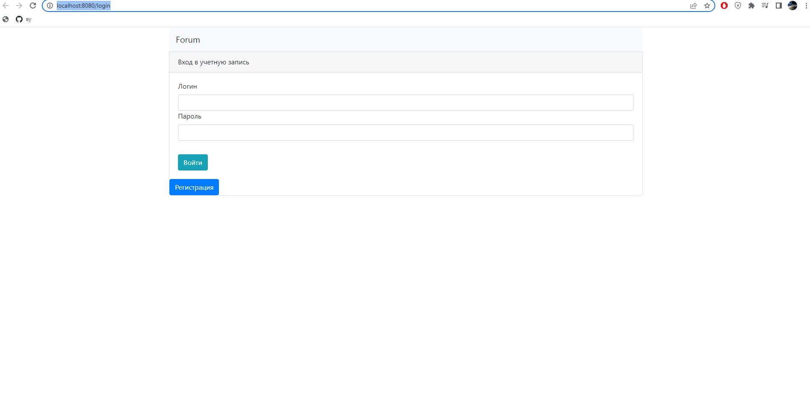
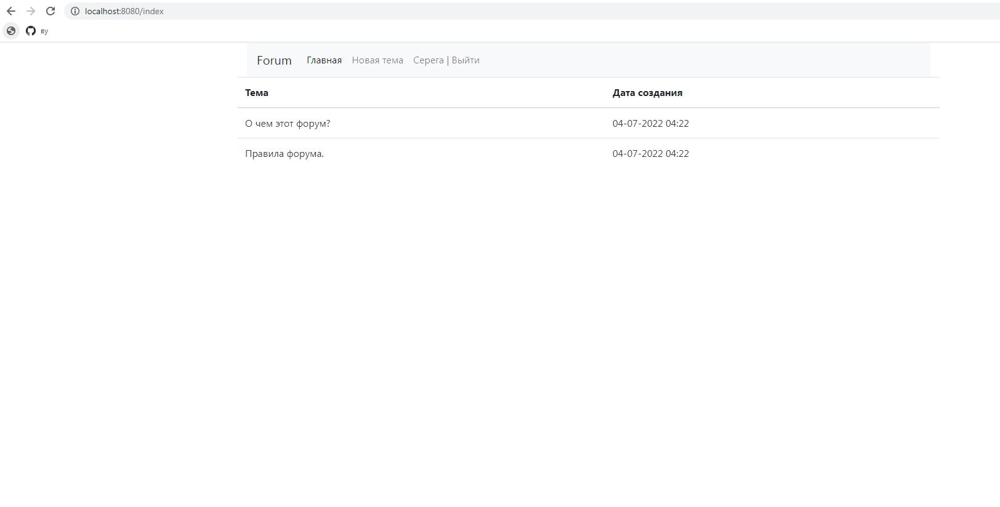
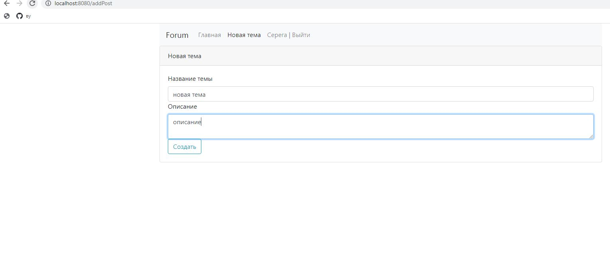
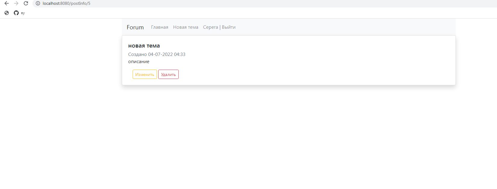

# job4j_forum

Forum
This project is the simple forum. Users can add and edit posts.

###Technologies
Spring Boot(Web, Data, Security)
PostgreSQL
Liquibase
Thymeleaf

### Functionality:
Login page

Main page

Create post

Edit post

